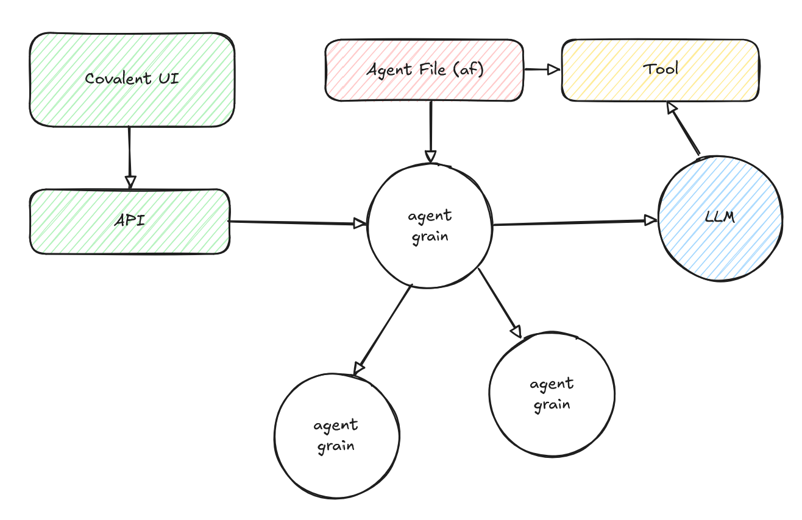

# Covalent

Covalent is a prototype for deploying AI Agents using [Microsoft Orleans](https://github.com/dotnet/orleans), fully compatible with Letta's [agent-file](https://github.com/letta-ai/agent-file) spec.



# Configuration

Covalent uses [Hitch](https://github.com/jsedlak/hitch) to support plug and play development.

```csharp
var hitch = builder.AddHitch(b =>
    b.WithFilePattern("Covalent.*.Plugin.dll")
);

var silo = builder.AddProject<Silo>()
    .WithReference(hitch);
```

This allows for simple plug-and-play development. Simply add the desired package to the AppHost & Silo and add the plugin to the AppHost.

Optionally these can be given a name to make their appearance in the UI friendlier.

```csharp
hitch.WithPlugin<FoundryOpenAIProviderPlugin>("Foundry - OpenAI", foundryResource);
hitch.WithPlugin<OllamaResponsesPlugin>("Ollama Responses", ollamaResource);
hitch.WithPlugin<AzureAISearchIndexPlugin>("Azure AI Search", azureSearchResource);
```

## Agents

The combination of data, instructions, and platform as a interactive piece of AI.

## Deployments

Deployments are Agents that are made available as a consumable resource. Think of them as a snapshot of an Agent made available via an API.
